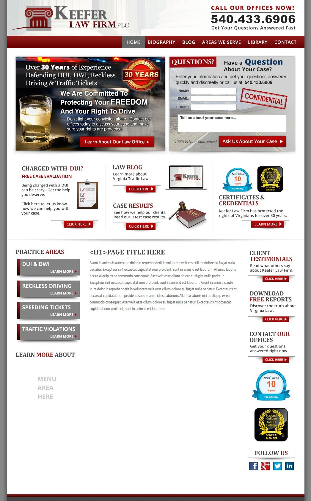

# Keefer Bootstrap Conversion

## Table of contents

- [Overview](#overview)
  - [The challenge](#the-challenge)
  - [Screenshot](#screenshot)
  - [Links](#links)
- [My process](#my-process)
  - [Built with](#built-with)
  - [What I learned](#what-i-learned)
  - [Continued development](#continued-development)
  - [Useful resources](#useful-resources)
- [Author](#author)
- [Acknowledgments](#acknowledgments)

## Overview

### The challenge

The goal was to create a clean, responsive layout for a law firm that highlights its practice areas, testimonials, and contact information. Key challenges included creating a structured layout that is intuitive for users and adaptable across different screen sizes.

### Screenshot

- **Keefer Bootstrap Conversion**

### Links

- Solution URL: [https://github.com/HooriaSaeeda/Keefer_Bootstrap_conversion.git](https://github.com/HooriaSaeeda/Keefer_Bootstrap_conversion.git)
- Live Site URL: 

## My process

### Built with

- **HTML5** and **CSS3** for semantic markup and styling
- **Bootstrap 5** for responsive grid and layout components
- **Google Fonts** for typography (using Lora and Poppins font families)

### What I learned

While building this template, I improved my skills in responsive design with Bootstrap and gained insights into structuring HTML content for readability. Implementing the testimonials and downloadable report sections helped reinforce my understanding of modular layout components.

### Continued development

or future projects, I plan to:

- Explore other responsive frameworks, like Tailwind CSS, to compare with Bootstrap.
- Experiment with adding JavaScript interactivity for more engaging user experiences.
- Improve accessibility by implementing ARIA attributes and testing screen reader compatibility.

### Useful resources

- [Bootstrap Documentation](https://getbootstrap.com/docs/5.0/getting-started/introduction/) - Invaluable for learning about responsive grid layout and utilities.
- [Google Fonts](https://fonts.google.com/) - Great resource for enhancing typography.

## Author

- Github - [hoor23](https://github.com/hoor23)
- Frontend Mentor - [hoor23](https://www.frontendmentor.io/profile/hoor23)
- Linkedin - [Hoor Seyda](linkedin.com/in/hoor-seyda-901176222)

## Acknowledgments

Special thanks to the online frontend development community for providing valuable resources and inspiration. Also, thanks to friends and colleagues who provided feedback during development.